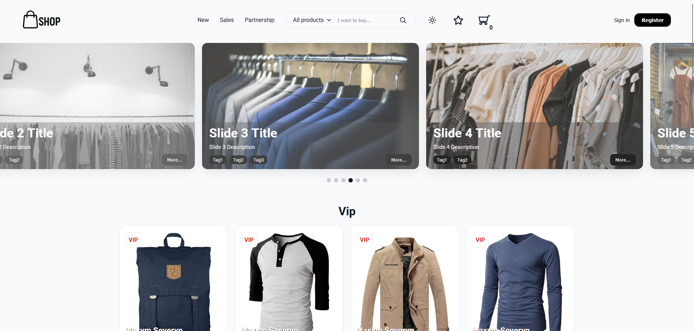

# React E-Commerce

Responsive e-commerce interface built with **React.js**.

## Table of Contents
1. [Overview](#overview)  
2. [Features](#features)  
3. [Prerequisites](#prerequisites)  
4. [Installation](#installation)  
5. [Usage](#usage) 

---

## Overview  
A clean and responsive e-commerce interface created using React.js.  
This project was bootstrapped with **Create React App**.

<p align="center">
  
</p>

---

## Features  
- Responsive, mobile-first design  
- Built with modern React tooling  
- API-based product loading  
- Material UI styling  

---
## Prerequisites  
Make sure you have the following installed:  
- [Node.js](https://nodejs.org/) (v14 or later recommended)  

## Installation  
Clone the repository and install dependencies:

```bash
git clone https://github.com/maxseveryn/react-ecommerce.git
cd react-ecommerce
npm install
```

## Usage

```bash
npm start
```
Open [http://localhost:3000](http://localhost:3000) to view it in your browser
The page reloads automatically on file changes
